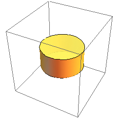
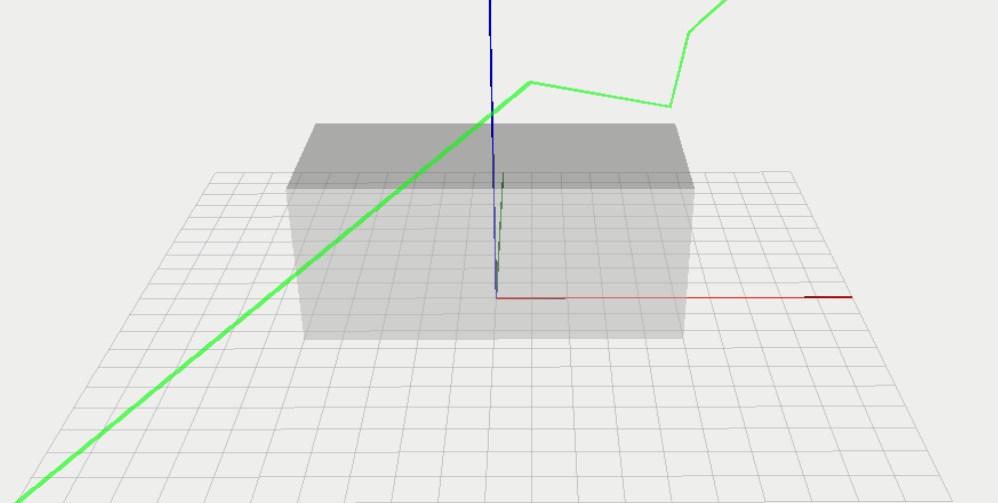
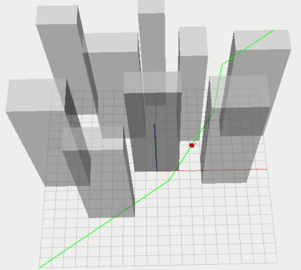
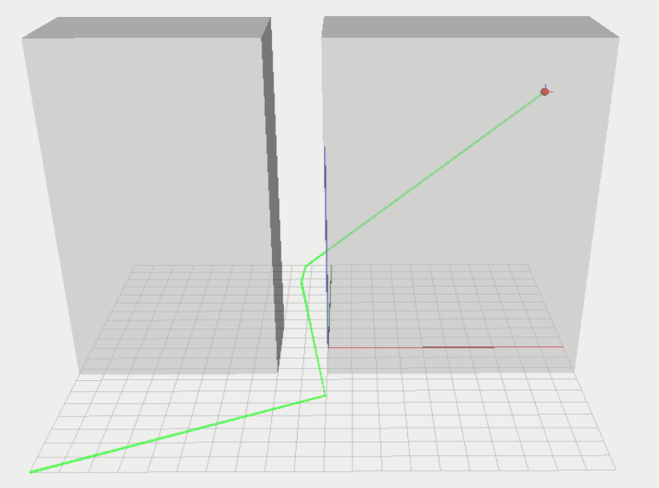
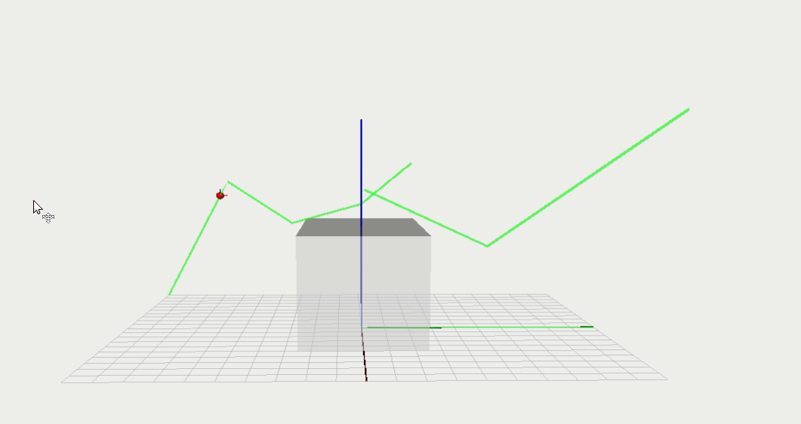
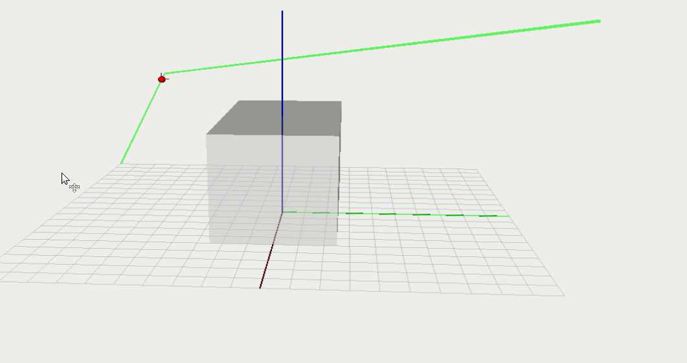

## Introduction

The problem I solved was motion planning for a holonomic cylindrical robot in a 3D environment with obstacles. The environment was represented as a 10x10x10 cube and the robot as a cylinder with radius and height equal to 0.5, there is an approximate image of the agent below. The obstacles and robot were defined as collision objects using the FCL library, which was used for static collision detection. I used a PRM based technique to solve this problem. Below I provide details on the PRM implementation, analysis of the algorithms performance, and a conclusion containing what I thought was interesting about this technique, including ideas for improvements. 



## PRM Implementation

#### Overview

PRM motion planning is generally broken into learning, query, and smoothing phases. My implementation of each of these phases is discussed below.

#### Learning Phase

The goal of the learning phase is to generate random configurations in c-free and connect them together into a searchable graph.

##### Generating random configurations

Configurations are made up of a position component (i.e., x, y, and z for 3D) and a rotational component. The position component is relatively simple to randomly generate. I generated a random number from a uniform distribution for each of the x, y, and z components and stored these in a Point object. The rotational component requires a little more thought. I used quaternions to represent my rotational component and used the method described in Kuffner's _"Effective Sampling and Distance Metrics for 3D Rigid Body Path Planning"_ to randomly sample unit quaternions and stored them in a Quaternion object. Below is the snippet of Python code used to do that.

```python
def generate_random_quaternion(self):
    rand = random.uniform(0, 1)

    a = math.sqrt(1 - rand)
    b = math.sqrt(rand)
    c = 2*math.pi*random.uniform(0, 1)
    d = 2*math.pi*random.uniform(0, 1)

    w = math.cos(d) * b
    x = math.sin(c) * a
    y = math.cos(c) * a
    z = math.sin(d) * b

    quaternion = Quaternion(w, x, y, z)
    return quaternion
```
The number of configurations generated is a parameter that can be modified. Allowing more configurations will cover more of c-free and make finding solutions when searching the graph more likely, but will also increase the density of your graph and impact search performance.

In order to ensure the configurations generated were in c-free, I used the FCL library to place my robot at that position and check for collisions against all obstacles.

##### Connecting Configurations

Once you have a set of configurations, they need to be connected into a graph. To do this we iterate through each configuration and attempt to connect a path between it and its closest neighbors. A potential path between two configurations is interpolated and checked for collisions. We continue this process until we find _k_ collision free paths, where _k_ is a parameter that can be modified. The interesting part of implementing this was in computing and storing distances, and interpolating paths.

###### Computing Distances

I computed the distance as a weighted sum between the translational and the rotational components. I calculated the rotational distance using the inner product of the two quaternions, as described in Kuffner's paper. Code snippets showing these calculations are below. Using this distance, I calculated the _k_ nearest neighbors naively, computing the current configuration's distance from all other configurations and sorting the result (performance could be improved by using a k-d tree).

```python
#computes traditional euclidian distance in 3D
def translational_distance(self, c1, c2):
    x_diff_sqrd = (c2.point.x - c1.point.x) ** 2
    y_diff_sqrd = (c2.point.y - c1.point.y) ** 2 
    z_diff_sqrd = (c2.point.z - c1.point.z) ** 2 

    trans_distance = math.sqrt(x_diff_sqrd + y_diff_sqrd + z_diff_sqrd)

    return trans_distance

#computes inner product of the two quaternions
def rotational_distance(self, c1, c2):

    scale = c1.quaternion.w * c2.quaternion.w
    x = c1.quaternion.x * c2.quaternion.x
    y = c1.quaternion.y * c2.quaternion.y
    z = c1.quaternion.z * c2.quaternion.z

    rot_distance = 1 - abs(scale + x + y + z) 

    return rot_distance

#computes the difference between two configurations by weighting and summing the 
#translational and rotational components
def distance(self, c1, c2):
    trans_distance = self.translational_distance(c1, c2)
    rot_distance = self.rotational_distance(c1, c2)

    #these weights are used to adjust the significance of each type of movement
    weight_rot = 0.25
    weight_trans = 1.0
    weighted_dist = (weight_trans * trans_distance) + (weight_rot * rot_distance)
    return weighted_dist
```
###### Interpolation
The translational interpolation was done by creating a difference vector between the current and final positions and then incrementing the individual components of that vector by a small step size. Simultaneously, rotational interpolation is performed using SLERP, as described by Kuffner. At each step the new position and orientation are checked for collisions using FCL. The number of steps control the number of collision detections that will be performed, and therefore, have a substantial impact on performance. However, the number of steps must be large enough to consistently detect collisions between the robot and obstacles. Below are the methods implemented to perform interpolation.

```python
def slerp(self, start_quat, weight, final_quat):
    w1 = start_quat.w
    x1 = start_quat.x
    y1 = start_quat.y
    z1 = start_quat.z

    w2 = final_quat.w
    x2 = final_quat.x
    y2 = final_quat.y
    z2 = final_quat.z

    inner_prod = (w1 * w2) + (x1 * x2) + (y1 * y2) + (z1 * z2)
    if inner_prod < 0:
        w2 = -w2
        x2 = -x2
        y2 = -y2
        z2 = -z2
        inner_prod = abs(inner_prod)
    
    e = 0.5 #value to determine if we need slerp
    if abs(1-inner_prod) < e:
        r = 1 - weight
        s = weight
    else:
        alpha = math.acos(inner_prod)
        gamma = 1 / math.sin(alpha)
        r = math.sin((1-weight)*alpha)*gamma
        s = math.sin(weight*alpha)*gamma
    
    w = r*w1 + s*w2
    x = r*x1 + s*x2
    y = r*y1 + s*y2
    z = r*z1 + s*z1

    mag = math.sqrt(w**2 + x**2 + y**2 + z**2)

    return Quaternion(w / mag, x / mag, y / mag, z / mag)

def is_iterpolated_collision(self, start_point3d, start_quaternion, final_point3d, final_quaternion):

    diff_vector = [final_point3d.x - start_point3d.x, final_point3d.y - start_point3d.y, final_point3d.z - start_point3d.z]
    next_rotation = start_quaternion

    for r in range(self.iter):
        
        next_position = [start_point3d.x + (r / self.iter)*diff_vector[0], start_point3d.y + (r / self.iter)*(diff_vector[1]), start_point3d.z + (r / self.iter)*diff_vector[2]]
        next_rotation = self.slerp(next_rotation, r / self.iter ,final_quaternion)
        
        self.agent.setTranslation(np.array(next_position))
        self.agent.setQuatRotation(np.array([next_rotation.w, next_rotation.x, next_rotation.y, next_rotation.z]))
        for obstacle in self.obstacles:
            request = fcl.CollisionRequest()
            result = fcl.CollisionResult()
            ret = fcl.collide(self.agent, obstacle['obj'], request, result)
            if ret > 0.0:
                return True
    return False
```
#### Query Phase

Once the learning phase is complete and the roadmap has been constructed it can now queried to find paths between initial and goal configurations. Given an initial and goal configuration, the algorithm attempts to add them to the existing network through a method that is similar to how edges are added between configurations. 

The closest _k_ neighbors are found for both configurations and a path between each of those _k_ neighbors is attempted until either a collision free path is discovered, or all _k_ neighbors have been tried. A difference between this method and the method above is that only _k_ attempts are made to connect the configurations to the graph. Once _k_ attempts have been made, if no connections have been found, we return failure. 

If the initial and goal configurations were successfully added to the graph it can be searched to find a path between them. I implemented Dijkstra's algorithm to search the graph for a shortest path. 

#### Smoothing Phase

If a valid path between two configurations is found, smoothing that path could be useful. Smoothing can cut down on the intermediate positions the robot will take between the two configurations, and cut down on the overall distance travelled. 

I implemented a greedy smoothing strategy. It works by trying to connect the initial node directly to the goal node with a collision free path. If that connection fails it moves up a node until either it finds a connection that isn't immediately prior to the goal node and can connect to it, or doesn't find any new connections. If it finds a new connection it restarts the process using the node it found in the previous sweep as the new goal node. If no new connections were found it moves the goal node to the node prior to it and restarts the process.

Once that smoothing process has completed I search the graph again, any improvements will be reflected in the new search, otherwise I would receive the same path. Below is pseudocode that reflects the process described above. I didn't include snippets directly from my project code because the process is clouded by naming conventions and method parameters.

```python
def smooth_path(path):
    smoothing = True
    init_node = path[0]
    goal_node = path[-1]
    goal_index = len(path)
    while smoothing:
        found_improvement = False
        
        for node in path:
            if no_collision(node, goal):
                add_edge(node, goal)
                goal_node = node
                found_improvement = True
                break
        
        if not found_improvement:
            goal_index -= 1
            goal_node = path[goal_index]
        
        if init_node == goal_node:
            smoothing = False

    smooth_path, dist = graph.search(path[0], path[-1])
    return smooth_path, dist
```

## Analysis

I tested my implementation against three different environments with varying parameters for the number of configurations generated, and the number of _k_ neighbors. I analyzed each combination's performance on runtime, chance of success and distance travelled. I also provide results for the path before and after smoothing. Below is a brief description of each environment followed by a breakdown of the performance results.

#### Sparse Environment

The sparse environment consisted of one box obstacle centered in the plane. It was tall enough to either force the path to go around, or over, the obstacle to reach the goal destination. 



#### Dense Environment

The dense environment contained several box obstacles that cluttered c-free. It forced the algorithm to wind around multiple objects.



#### Narrow Environment

The narrow environment contained two large box obstacles. It forced the algorithm to pass through a narrow passage to reach the goal. 



#### Results

The results below were generated in a 10x10x10 environment and the averages are calculated over 500 iterations. In each iteration the initial position was in the bottom left (-10,-10,0) and the goal was in the top right (10,10,10).

| Environment | Neighbors | Configurations | Avg Runtime (seconds) | Avg Distance (no path smoothing) | Avg Distance (path smoothing) | % Success |
|-------------|-----------|----------------|-----------------------|------------------------------|---------------------------|-----------|
| sparse      | 3         | 30             | 0.12                  | 45.66                        | 32.68                     | 81.61     |
| sparse      | 7         | 80             | 0.74                  | 37.60                        | 31.82                     | 100.00    |
| dense       | 3         | 30             | 0.28                  | 48.90                        | 38.6                      | 8.0       |
| dense       | 7         | 80             | 1.77                  | 44.67                        | 38.4                      | 64.0      |
| narrow      | 3         | 30             | 0.145                 | 47.92                        | 37.06                     | 3.98      |
| narrow      | 7         | 80             | 0.89                  | 41.37                        | 35.45                     | 41.2      |    

As expected the sparse environment was the easiest to solve and a path can be reliably found using eighty configurations. Another interesting finding is that even though the narrow environment was the most difficult for the algorithm to solve, it was more runtime efficient than the dense environment and had similar run times to the sparse environment. This is because even though the passage is difficult to cross its overall obstacle density isn't substantial and collisions when generating configurations, or attempting to connect paths, are minimal. 

I was not particularly satisfied with the algorithm's performance on the dense and narrow environments so I decided to double the number of configurations and try again, which resulted in the data below.

| Environment | Neighbors | Configurations | Avg Runtime (seconds) | Avg Distance (no path smoothing) | Avg Distance (path smoothing) | % Success |
|-------------|-----------|----------------|-----------------------|------------------------------|---------------------------|-----------|
| dense      | 7         | 160             | 2.83                  | 48.45                       | 39.14                     | 73.44     |
| narrow     | 7         | 160             | 1.36    |40.77|34.73|40.11

This second attempt seemed to increase the performance in the dense environment substantially, but had no effect on the narrow environment. This leads me to believe that to see significant gains in the narrow environment, I would need to change some aspects of how configurations are generated. In class we discussed PRM planners that used the medial axis to better navigate tight areas, I think that implementation would be useful here.

## Conclusion

Overall, I think the PRM implementation was a good method for solving this problem. Below are some improvements that I would have liked to have made given more time, and a couple of next steps. Lastly, there are some GIFs showcasing successful paths visualized in ROS. You will notice in the animations that the robot is spherical, and only rotates around the vertical axis. This is because while the robot in my code is cylindrical and uses quaternions to represent rotation around all axes, I didn't update the URDF for Sphero to reflect this. I left the agent spherical and extracted the yaw from quaternions using the methods described in LaValle's "_Motion Planning_". 

#### Improvements

There are some improvements I could make to this implementation to improve performance. When I compute the distances between configurations, I could store them in a k-d tree which can be used to limit the number of comparisons made when finding the nearest neighbors to a given configuration. Also, I could use a priority queue in Dijkstra's algorithm to reduce the complexity of the graph searching from _O(n^2)_ to _O(nlogn)_.

#### Next Steps
The version I implemented was the vanilla PRM and there are many alterations that can be made for better performance depending on the suspected environment. I would have liked to have compared my implementation to a lazy PRM, which doesn't perform collision detection when storing configurations, or to the visibility PRM, which reduces graph density. 

#### Successful Paths from ROS

Here is Sphero successfully navigating the dense environment. 


The two GIFs below are from the same PRM the first without path smoothing and the second with it.



